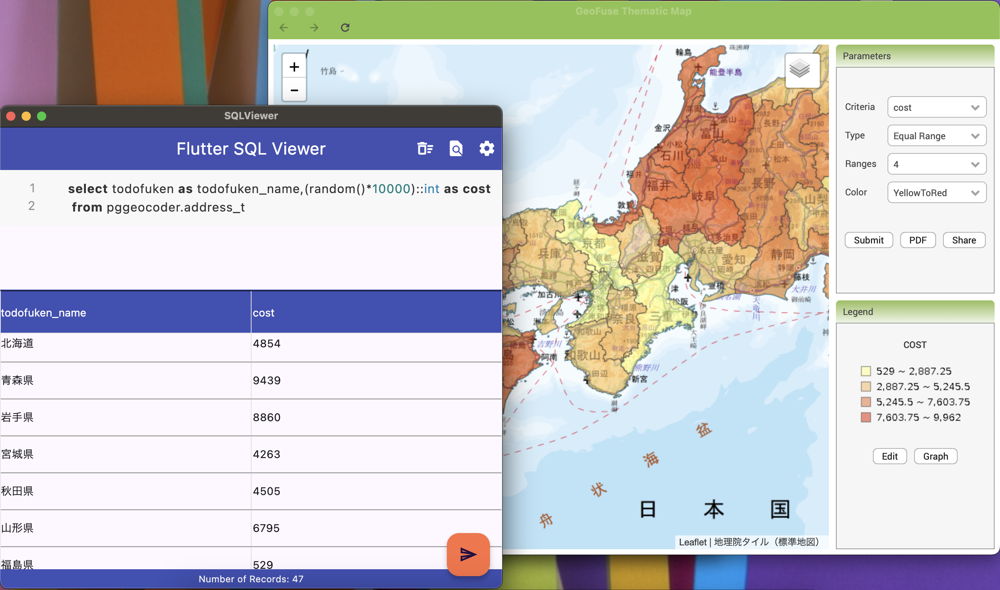
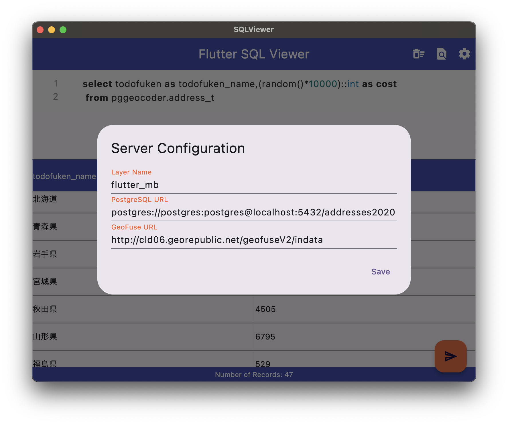

# flutter_sqlview



Flutter SqlView is a PostgreSQL Client which will display the results of a SQL query
in a grid table. SqlView will also push the data into [GeoFuse](http://github.com/mbasa/GeoFuse)
if the data is mappable, and display the GeoFuse created Thematic Map into a new window. 

**Spatial Analytics** can be accomplished with this tool,
especially when used in conjunction with 
[pgGeocoder](https://github.com/mbasa/pgGeocoder) and 
[postGIS](http://postgis.org/).


This has only been tested in a MacOS Desktop Environment. 

### Configuration



The following Server Parameters can be 
configured: 

* Layer Name - The Layer Name that will appear in the GeoFuse Console to identify the Thematic Map(s) created.

+ PostgreSQL Url - The Url that will be used to connect to the PostgreSQL Server to access the Database specified. The URL should be in the following format:

```
postgres://<user>:<password>@<hostname>:<port number>/<database name>
```

* GeoFuse Url - The Url of the GeoFuse servlet that will be used to `Post` data from a SQL query in order for GeoFuse to create a Thematic Map. The URL should be in the following format:

```
http://<hostname>/geofuse/indata
```